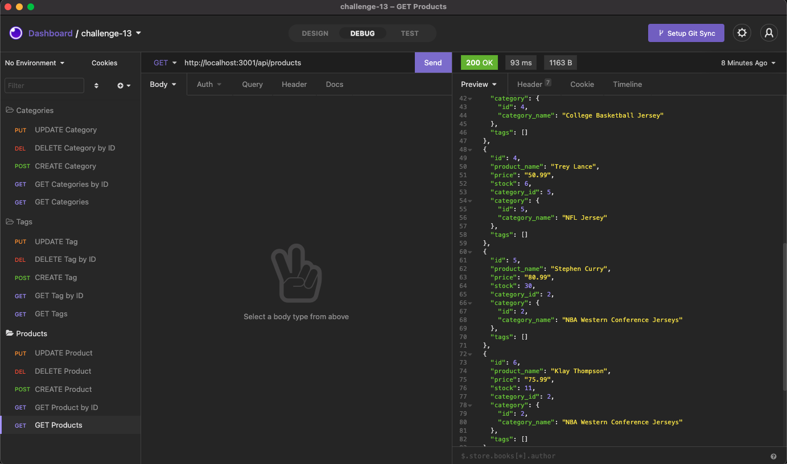

# Project Title
Challenge 13 

# Description
This back end project uses Object-Relational Mapping (ORM) to support an e-commerce site.
There is no front end linked to this project, so the functionality can be viewed using Insomnia or other equivalent programs.

Follow this [link](https://github.com/abergtra/challenge-13) for the GitHub repository.

# Table of Contents 
* [Installation](#-Installation)
* [Usage](#-Usage)
* [License](#-Installation)
* [Contributing](#-Contributing)
* [Tests](#-Tests)
* [Questions](#-Questions)
    
# Installation
Step #1: Run `npm install` in your command line. Ensure all required libraries are installed (express, sequelize, mysql2, etc).
Step #2: Start your mysql.
Step #3: Create a .env file with your password.
Step #4: Run `npm run seed` in you command line.
Step #5: Run `node server.js` in you command line.
Step #6: Open Insomnia and explore your new backend product!

Installation Walkthrough:

A video walkthrough is also available if you follow this [link](https://youtu.be/bdrpvL1s2Ts).

# Usage
Explore the back end product's functionality by following the "Installation" instructions until you are ready with Insomnia.
Here are some examples of what you can do with this product.

Categories Walkthrough:

A video walkthrough is also available if you follow this [link](https://youtu.be/m52rLbBrGuw).

Tags Walkthrough:

A video walkthrough is also available if you follow this [link](https://youtu.be/6AI0i1G0aGU).

Products Walkthrough:

A video walkthrough is also available if you follow this [link](https://youtu.be/r15rppoT7jM).

# License 
[License: MIT](https://opensource.org/licenses/MIT) 
* As this list provided is not comprehensive, if you need another license, contact the author for additional options. 

# Contributing 
Please contact the author about contributing.

# Tests
There are no tests available for this application.

# Questions
* GitHub Username: abergtra
* Contact Email: asher.bergtraun@gmail.com